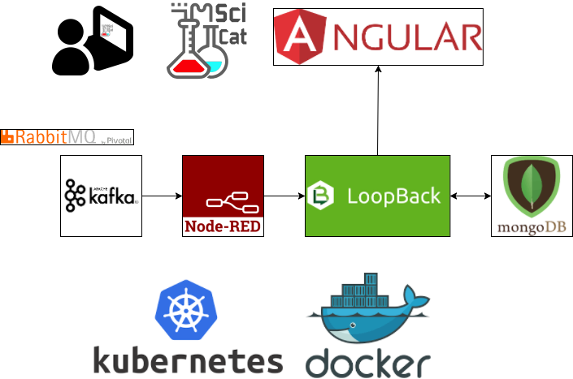
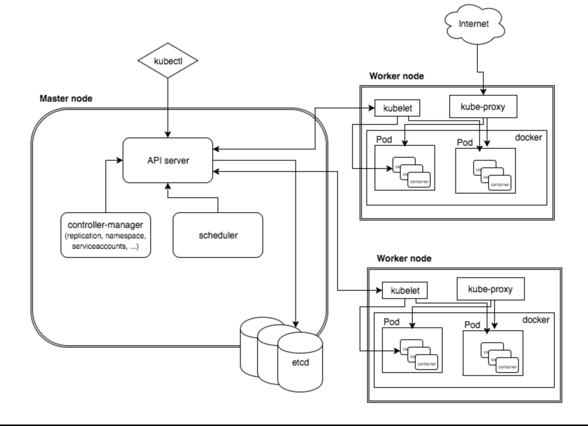
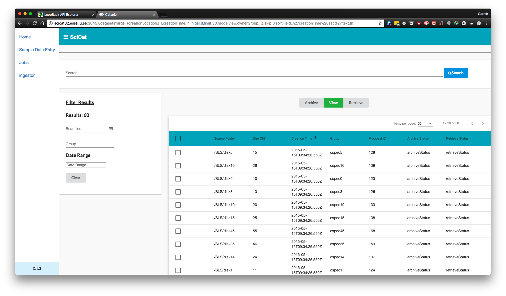
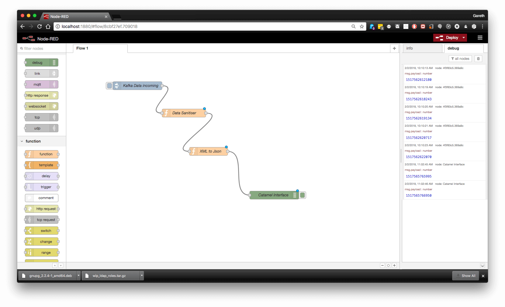
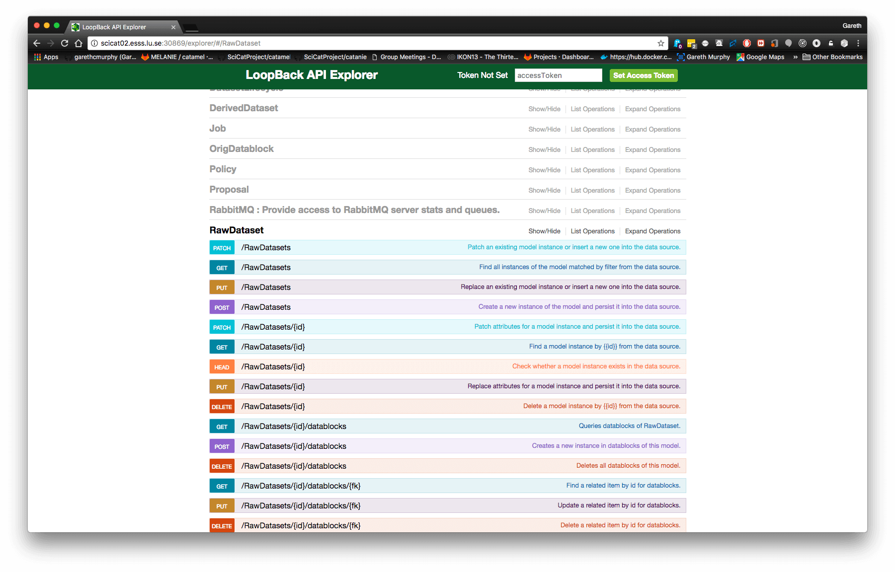
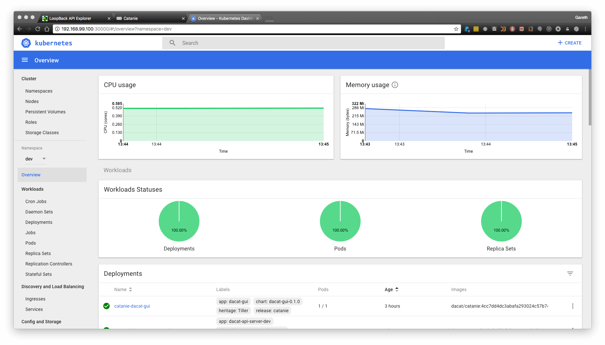
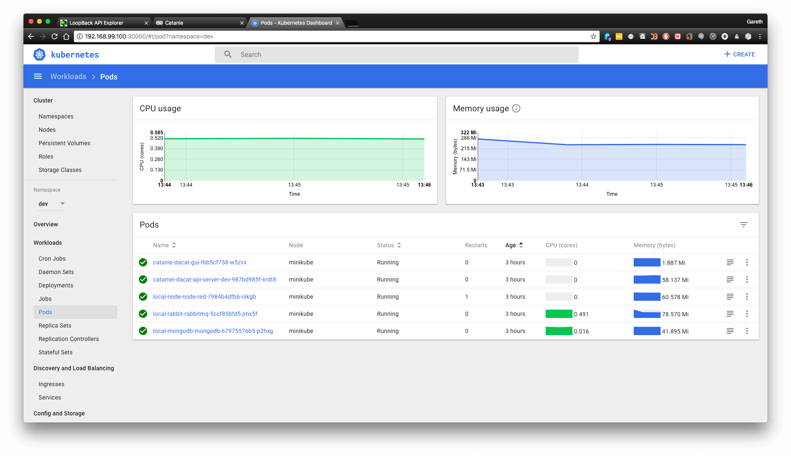
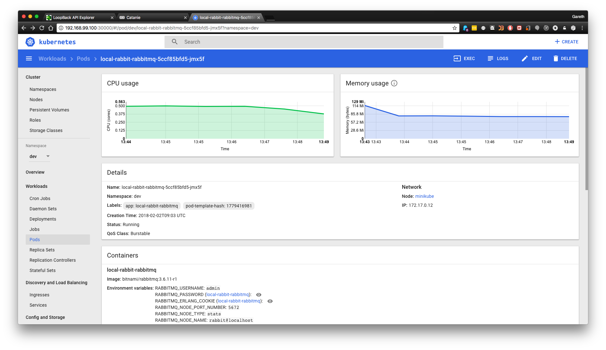

### Managing Unstructured Metadata at ESS

Gareth Murphy, European Spallation Source

Helmholtz-Zentrum Berlin
2018-03-19

---

### What is metadata?

- a set of data that describes and gives information about other data.
- Can classify into separate types
- administrative
- structural
- descriptive

---

### SCIENTIFIC METADATA

> … is often notoriously incomplete. Additional quantities and assumptions necessary to interpret the data may initially only be recorded on scraps of paper, hard-coded into analysis software or only exist in the experimenter's head.

- more extensive 
- less predictable - "unknown unknowns"

---

### Why not use existing tools?

- performance and flexibility issues 
- SQL database technology aging
- NoSQL offers more opportunities for unstructured data
- SQL is highly structured in tables with rows and columns
- MongoDB, a NoSQL DB,  uses documents organised in collections.

---
### Metadata at ESS

- Metadata is complex
- Not always predictable what is important
- Keep all data and make it easy to search for important features?
- Most scientific data is unFAIR
- Findable, Accessible, Interoperable, Reproducible

---

### Currently metadata can be stored 

 

<ul>
<li> In filename (run1_vanadium)</li>
<li> In Excel files - not accessible</li>
<li> Not at all</li>
</ul>

---

---

### Using a data catalogue

- One source of information
- All data can be found on one website
- Manages permissions, publication
- User reads a publication, can get data from catalogue

---

### SciCat

- [github.com/ScicatProject](https://github.com/Scicatproject)
- Manage the meta data of raw and derived data which is taken at
experiment facilities
- administrative : data management lifecycle, ownership, file
- scientific: describing the sample, beamline and experiment
parameters relevant for the users data analysis
---

### Dataset, Datafile, Datablocks

- A dataset includes all metadata related to a set of tiles
- Has an owner, ORCid, creation  time, science metadata  etc, and includes datafile references
- A datafile has path, size, permissions
- Datablocks are storage media for archiving, one datafile can be stored across on or more datablocks

---

### Raw Dataset vs Derived Dataset

- RawDataset - experimental data directly from beamline
- Derived Dataset - has extra fields indicating origin of generated data.
- 
---

### Scientific Metadata 

- Each dataset stores scientific metadata as an array.
- Users will be able to add their own metadata fields.

- 

---

### SciCat
- Enables management of the lifecycle of the data from creation ,
data analysis and eventual deletion
- Data can be linked to proposals and samples
- Data can be linked to publications (DOI, PID)
- Data can be migrated to and from longterm storage on tape

---

### SciCat
- Reproducibility- Helps keeping track of data provenance (i.e. the steps leading to
the final results)
- Allows checking scientific integrity (checksum of data)
- Findability - Allows find data based on the meta data (your own data and
other peoples public data)
- In the long term:help to automate standardized analysis workflow
---

### SciCat - collection of microservices
- Web frontend (catanie - [angular](http://angular.io) based)
- API service backend (catamel- Automatically generated using IBM's [loopback.io](http://loopback.io)
- Database [MongoDB](https://www.mongodb.com/)
- Message/job queuing system (currently RabbitMQ -> migrating to [Kafka](http://kafka.apache.org))
- Flow-based editor [Node-RED](https://nodered.org/)

---

### SciCat architecture

---

### Kubernetes Deployment

- Can test kubernetes deployment using minikube, without installing a full cluster
- Try it yourself!
- Working minikube config at http://www.github.com/ScicatProject/localdeploy
- RBAC disabled by default - can re-enable

---

### Kubernetes architecture

---

## Kubernetes

- Applications are deployed to "pods", which are made available using services, which are accessed using ingress
- For each of the 5+ services we need to configure:
    1. Deployments
    2. Services
    3. Pods (can be groups of containers, we typically use single containers)
    4. Ingress
- for each of 5 microservices, 4 configurations = 20 config files

### MongoDB

- NoSQL storage of metadata, login, jobs
- Database requires persistent storage
- Currently we store on k8s nodes, not a longterm solution

---

### Catanie

- Angular website
- Javascript generated static html
- Data served by catamel
- Viewable on PC, phone etc

---

### Catanie

---

### Node-RED

- Translate metadata from Kafka stream XML to catamel format (JSON)
- Can be used to add in extra data cleaning  or processing

---

### Node-RED

---

### Catamel

- Metadata server
- Loopback generated API
- Models defined in JSON
- Also provides connectivity to authentication server(s)

---

### Catamel

---

### Dashboard Overview

---

### Pods Overview

---

###  Pod CPU & Memory

---

### Deployment of scicat

- still outstanding:
- persistent storage
- file viewer
- data download

---

## Conclusion

- SciCat on Kubernetes will be able to provide metadata services for ESS users needs
