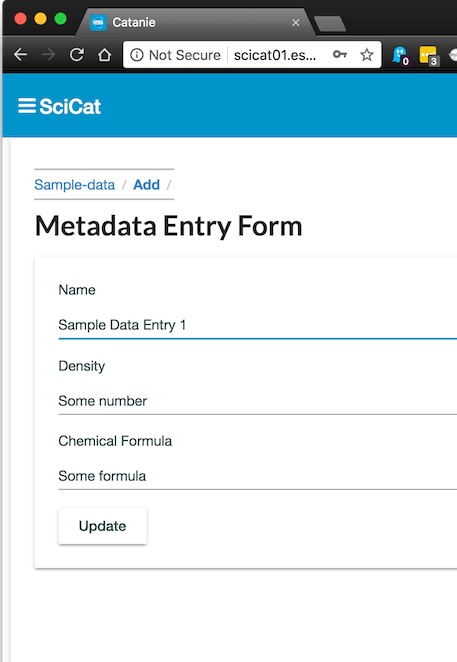

### Managing Unstructured Metadata at ESS

Gareth Murphy, European Spallation Source

<a href="https://orcid.org/0000-0002-2785-3674" target="orcid.widget" rel="noopener noreferrer" style="vertical-align:top;">orcid.org/0000-0002-2785-3674</a>

Helmholtz-Zentrum Berlin

2018-03-19

https://mirrors.creativecommons.org/presskit/buttons/88x31/svg/by-sa.svg

---

### What is metadata?

- a set of data that describes and gives information about other data.
- Can classify into separate types
    - administrative
    - structural
    - descriptive
    - scientific

---

### SCIENTIFIC METADATA

> … is often notoriously incomplete. Additional quantities and assumptions necessary to interpret the data may initially only be recorded on scraps of paper, hard-coded into analysis software or only exist in the experimenter's head.

- more extensive 
- less predictable - "unknown unknowns"

---?image=assets/ESS_inst.png&size=auto 90%

---
### Metadata at ESS

- ESS metadata is complex
- Not always predictable what is important
- Most scientific data is unFAIR
- Findable, Accessible, Interoperable, Reproducible

---

### Currently metadata can be stored 

 

<ul>
<li> In filename (run1_vanadium)</li>
<li> In Excel files on HDD or Dropbox - not accessible</li>
<li> Not at all</li>
</ul>

---

### Using a data catalogue

 

<ul>
<li> One source of information</li>
<li> All data can be found on one website</li>
<li> Manages permissions, publication</li>
<li> User reads a publication, can get data from catalogue</li>
</ul>

---

### Why not use existing tools?

- performance and flexibility issues 
- SQL database technology aging
- NoSQL offers more opportunities for unstructured data
- SQL is highly structured in tables with rows and columns
- MongoDB, a NoSQL DB,  uses documents organised in collections.

---?image=assets/data_management.png&size=auto 90%

---

### SciCat

- [github.com/ScicatProject](https://github.com/Scicatproject)
- Manage the meta data of raw and derived data which is taken at
experiment facilities
- administrative : data management lifecycle, ownership, file
- scientific: describing the sample, beamline and experiment
parameters relevant for the users data analysis
---

### Dataset, Datafile, Datablocks

- A dataset includes all metadata related to a set of files
- Has an owner, ORCid, creation  time, science metadata  etc, and includes datafile references
- A datafile has path, size, permissions
- Datablocks are storage media for archiving, one datafile can be stored across on or more datablocks

---

### Raw Dataset vs Derived Dataset

 

<ul>
<li> RawDataset - experimental data directly from beamline</li>
<li> Derived Dataset - has extra fields indicating origin of generated data.</li>
</ul>

---

### Scientific Metadata 

 

<ul>
<li>
Each dataset stores scientific metadata as an array.
</li>
<li> 
Users will be able to add their own metadata fields.
</li>
</ul>

---

### SciCat
- Enables management of the lifecycle of the data from creation ,
data analysis and eventual deletion
- Data can be linked to proposals and samples
- Data can be linked to publications (DOI, PID)
- Data can be migrated to and from longterm storage on tape

---

### SciCat
- Reproducibility- Helps keeping track of data provenance (i.e. the steps leading to
the final results)
- Allows checking scientific integrity (checksum of data)
- Findability - Allows find data based on the meta data (your own data and
other peoples public data)
- In the long term:help to automate standardized analysis workflow
---

### SciCat - collection of microservices
- Web frontend (catanie - [angular](http://angular.io) based)
- API service backend (catamel- Automatically generated using IBM's [loopback.io](http://loopback.io)
- Database [MongoDB](https://www.mongodb.com/)
- Message/job queuing system (currently RabbitMQ -> migrating to [Kafka](http://kafka.apache.org))
- Flow-based editor [Node-RED](https://nodered.org/)

---?image=assets/SciCat.png&size=auto 90%

---

### Kubernetes Deployment

- Can test kubernetes deployment using minikube, without installing a full cluster
- Try it yourself!
- Working minikube config at http://www.github.com/ScicatProject/localdeploy
- RBAC disabled by default - can re-enable

---?image=assets/kube_arch.png&size=auto 90%

---

## Kubernetes

- Applications are deployed to "pods", which are made available using services, which are accessed using ingress
- For each of the 5+ services we need to configure:
    1. Deployments
    2. Services
    3. Pods (groups or single containers)
    4. Ingress
- for  5 services, 4 config = 20  files

---?image=assets/overview.png&size=auto 90%

---

### MongoDB

- NoSQL storage of metadata, login, jobs
- Database requires persistent storage
- Currently we store on k8s nodes, not a longterm solution

---

### Catanie

- Angular website
- Javascript generated static html
- Data served by catamel
- Viewable on PC, phone etc

---?image=assets/catanie.png&size=auto 90%

---

### Node-RED

- Translate metadata from Kafka stream XML to catamel format (JSON)
- Can be used to add in extra data cleaning  or processing

---?image=assets/nodered.png&size=auto 90%

---

### Catamel

- Metadata server
- Loopback generated API
- Models defined in JSON
- Also provides connectivity to authentication server(s)

---?image=assets/catamel.png&size=auto 90%

---

### Deployment of scicat

- still outstanding:
- persistent storage
- file viewer
- data download

---

## Conclusion

- SciCat on Kubernetes will be able to provide metadata services for ESS users needs
- MongoDB backend can handle unstructured metadata
- Users will be able to add their own metadata
